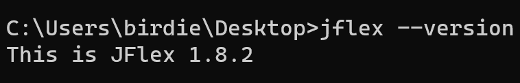
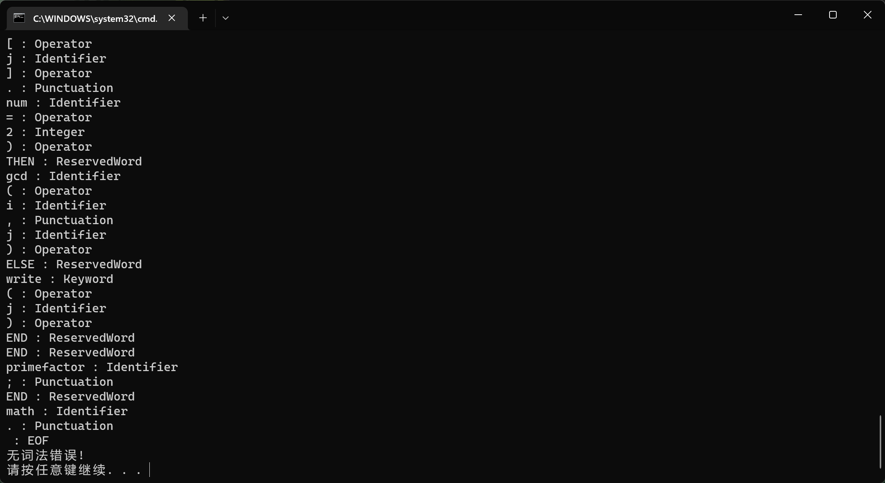
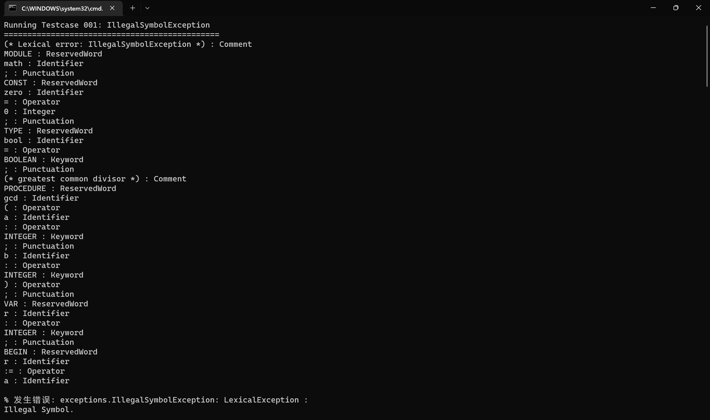
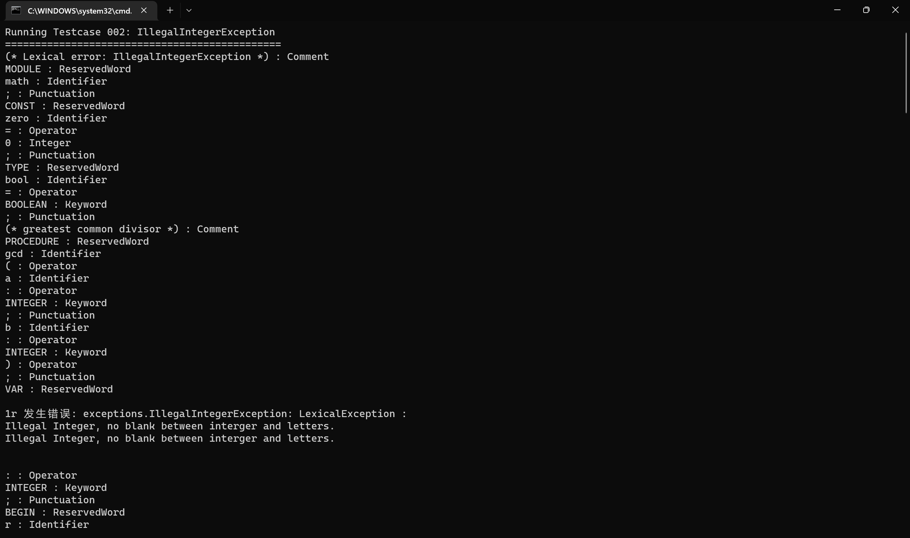
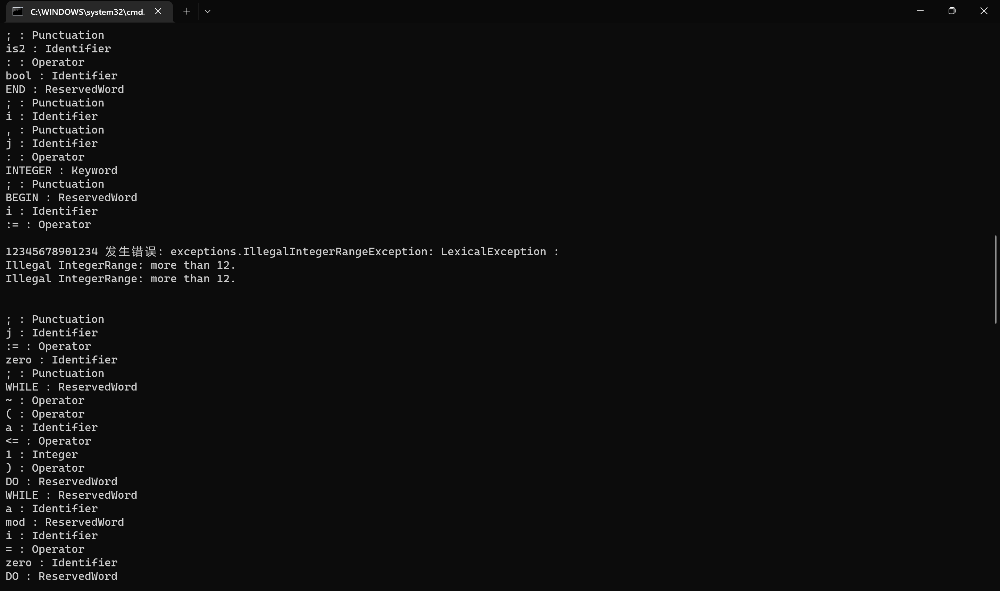
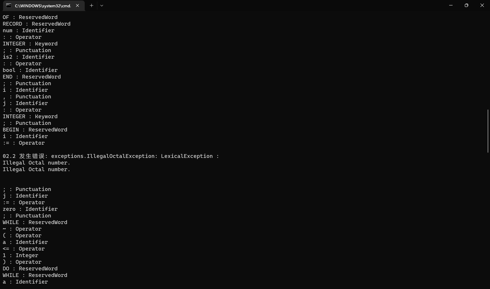
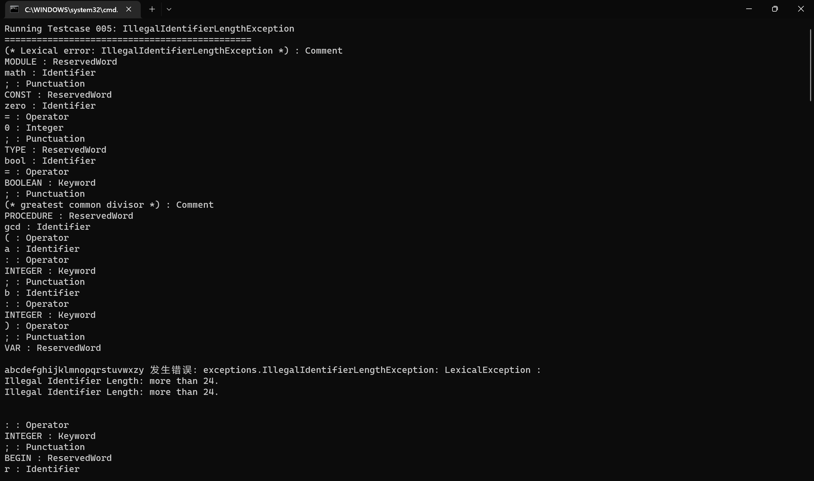
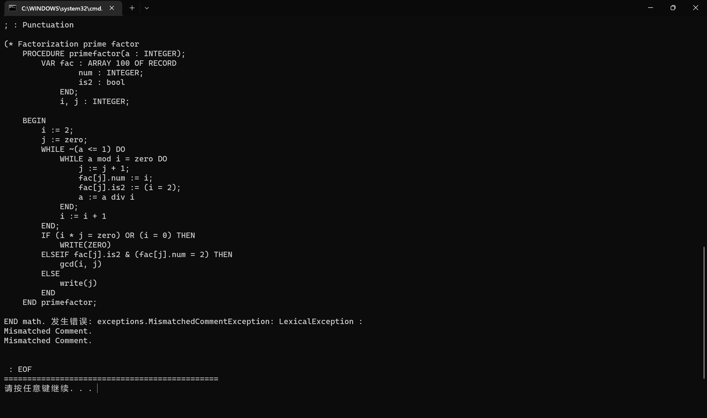

<center><b><font size = "7">编译原理实验


<center><b><font size = "5">复杂性度量工具 ALIOTH


<center><b><font size = "5">实验报告Part 2

<center><b><font size = "5">自动生成词法分析程序（JFlex）


### 1 开发环境与开发工具

#### 1.1 操作系统

Windows 11

#### 1.2 编程语言

java语言，JDK版本1.7.2

#### 1.3 开发工具

Visual Studio Code + cmd


### 2 实验内容

#### 2.1 总结 Oberon-0 语言的词汇表

> 根据 Oberon-0 语言的 BNF 定义和语言描述，抽取 Oberon-0 语言的词汇表以供词法分析程序设计与实现之用。你需要将 Oberon-0 的所有单词分类，并以表格形式列出各类词汇的预定义单词；譬如，在保留字表中列出所有的保留字，在运算符表中列出所有的运算符，等等。 
>
> 请在实验报告中说明你的单词分类的理由，并解释如何处理 Oberon-0 语言中保留字和关键字两类略有不同的单词。

##### 保留字与关键字

保留字与关键字在 Oberon-0 中的区别在于，**保留字**是 Oberon-0 预留的不可以使用与变量的一类单词，其本身具有划分程序结构、程序专用定义、运算符号等功能。而**关键字**实际上是一种特殊的标识符，是 Oberon-0 预写好的单词或者函数。程序员可以通过重写这些关键字使其具有特定的含义，可以作为标识符存在，也就是说程序员可以定义这类单词作为变量名。

| 字段   | 单词                                                         |
| :----- | ------------------------------------------------------------ |
| 保留字 | `MODULE` `BEGIN` `END` `CONST` `TYPE` `VAR` `PROCEDURE` `RECORD` `ARRAY` `OF` `WHILE` `DO` `IF` `THEN` `ELSIF` `ELSE`  `OR` `DIV` `MOD` |
| 关键字 | `INTEGER` `BOOLEAN` `READ` `WRITE` `WRITELN`                 |

##### 运算符

运算符按照运算符的功能，划分为如下分类：

| 运算符     | 单词                      |
| ---------- | ------------------------- |
| 关系运算符 | `=` `#` `<` `<=` `>` `>=` |
| 算术运算符 | `*` `DIV` `MOD` `+` `-`   |
| 逻辑运算符 | `&` `OR` `~`              |
| 赋值       | `:=`                      |
| 类型定义   | `:`                       |
| 括号       | `(` `)` `[` `]`           |

对于`.`，它在 Oberon-0 中有两种用途，一是作为引出结构体中的成员变量的运算符，二是作为`END`后的结束符存在。将其划分在运算符中抑或是在标点符号中都有道理，因此我将其划分入标点符号中。

##### 其他单词

| 字段     | 单词                          |
| -------- | ----------------------------- |
| 标点符号 | `;` `,` `.`                   |
| 注释     | [ `(*` {不含"\*)"的语句 `*)`] |
| 标识符   | letter {letter \| digit};     |
| 常量     | digit {digit}                 |


#### 2.2 抽取 Oberon-0 语言的词法规则

> 在 Oberon-0 语言的 BNF 定义中，既包括 Oberon-0 语言的语法定义部分，也包括 Oberon-0 语言的词法定义部分。请将词法定义从 Oberon-0 语言的 BNF 中分离出来，并写成正则定义式（Regular Expression）的形式。 然后，在实验报告中讨论与 Pascal 、C/C++、Java 等常见高级程序设计语言的词法规则相比，Oberon-0 语言的词法规则有何异同。

##### 正则定义式

**除去单词表中的单词**，仍有一些需要通过 BNF 定义的此法规则。

```
digit      -> [0-9] ;
letter     -> [a-z] | [A-Z] ;
integer    -> [1-9] {digit} | 0 {[0-7]};
identifier -> letter {letter | digit} ;
```

##### 词法规则讨论

Oberon-0 相对于 Pascal、C/C++、Java 更简单：

- Oberon-0 中的数值类型只有整形，没有浮点型。因此，无法用科学计数法表示一个整数，只能用简单的十进制无符号整数或者是八进制无符号整数表示一个整数。
- Oberon-0 相对于 C/C++、Java，其运算符有一些特别之处：用`DIV`表示整除而不是`\`，用`MOD`表示取模而不是`%`，用`~`表示非，用`#`表示不等于也是比较独特的地方。
- Oberon-0 的注释采用 `(* *)` 的方式，相对于其他高级语言也是比较特别的。


#### 2.3 下载词法分析程序自动生成工具 JFlex

> 实验二指定的词法分析程序自动生成工具选用由 Gerwin Klein 开发的 JFlex。这是一个类似 Unix 平台上 lex 程序的开源（Open Source）软件工具，遵循 GNU General Public License（GPL）。JFlex 本身采用 Java 语言编写，并且生成 Java 语言的词法分析程序源代码。该软件工具的前身是由美国普林斯顿大学计算机科学系 Elliot Berk 开发、C. Scott Ananian 负责维护的 JLex。
>
> 从 http://www.jflex.de/可下载该工具，当前的最新稳定版本是 2020 年 5 月发布的 JFlex 1.8.2。该网站提供的压缩文件中已包含了你在本实验中所需的各类资源，包括该工具的 Java 源代码、支持运行的库文件与脚本文件、用户文档、输入源文件例子等。
>
> 根据你自己的安装配置，修改 JFlex 安装目录下脚本文件 bin\jflex.bat 中的两个环境变量 JFLEX_HOME 和 JAVA_HOME 的设置。然后运行 JFlex 附带的输入源文件例子，以验证你是否正确安装并配置了 JFlex。
>
> 如果你觉得 JFlex 附带的用户手册仍不足以帮助你掌握 JFlex 的原理或用法，自己动手在网上查找其他关于 JLex、GNU Flex、lex 等类似工具的大量电子资源。

事实上，附件中提供了 `jfelx-full-1.8.2.jar` 作为 jflex 的集成工具。

##### 第一步 下载

从 [JFlex - JFlex The Fast Scanner Generator for Java](https://www.jflex.de/) 可以下载该工具。当前的最新稳定版本是 2020 年 5 月发布的 JFlex 1.8.2。该网站提供的压缩文件中已包含了你在本实验中所需的各类资源，包括该工具的 Java 源代码、支持运行的库文 件与脚本文件、用户文档、输入源文件例子等。

解压后可以发现，这是一个 java 工程标准的文件组织形式。

##### 第二步 修改配置

修改 JFlex 安装目录下脚本文件 bin\jflex.bat 中的环境变量 JFLEX_HOME 的设置。默认设置是 C:\Jflex，修改为下载 Jflex 的目录位置。同时需要添加 JAVA_HOME。

```
@echo off
REM Please adjust JFLEX_HOME and JFLEX_VERSION to suit your needs
REM (please do not add a trailing backslash)

set JFLEX_HOME=D:\software\jflex\jflex-1.8.2
set JFLEX_VERSION=1.8.2
set JAVA_HOME=D:\software\jdk

java -Xmx128m -jar "%JFLEX_HOME%\lib\jflex-full-%JFLEX_VERSION%.jar" %*
```

##### 第三步 添加环境变量

将 `\jflex-1.8.2\bin` 添加进环境变量。

##### 第四步 测试

重启后，在命令行中运行 `jflex --version` ，安装成功。




#### 2.4 生成 Oberon-0 语言的词法分析程序

> 仔细阅读 JFlex 的使用手册，根据你在实验步骤 2.1 给出的 Oberon-0 语言词法规则的正则定义式，编写一个 JFlex 输入源文件。
>
> 本实验提供的实验软装置为实验二预定义了代表 Oberon-0 语言各种词法错误的异常类，并为实验二设计了主程序 main()。你在实验二中不要改变 main()的内容，并且在你的词法分析程序中应根据词法错误的类别抛出相应的异常类。实验软装置还提供了一批测试用例，用于检测你的程序是否能够识别出词法错误并正确地对词法错误进行分类（通过抛出的异常类标识错误类别）。关于 ALIOTH 实验软装置的详细描述请参阅本文档第 5 部分。
>
> 以你编写的源文件作为输入运行 JFlex，得到一个 Oberon-0 语言词法分析程序的 Java 源代码；编译该源程序生成 Java 字节码。通过实验软装置提供的测试用例检查后，利用你在实验一编写的所有 Oberon-0 源程序测试你的词法分析程序。

##### JFlex 语法

JFlex 的目的是创建一个词法分析器，提供了输入检查，并确定所有的字符归类是有效的。我们需要给 JFlex 提供词法分析说明文件，该文件分为三个部分，每个部分由 `%%` 分开。

```
用户代码段
%%
参数设置和声明段
%%
词法规则段
```

**用户代码段**

这个段中的所有内容将被拷贝到生成的词法类的类声明之前。从下面的示例可以看出，这个部分提供了词法分析器所需要的外部文件和需要调用的库，一般是一些 `import` 和 `package`。

**参数设置和声明段**

这个段含有参数，词法状态和宏定义。

**设置参数**将包含额外的代码，它们将被包括在产生的扫描器类。参必须另开新行，以 % 开头。可以包含的参数很多。在随JFlex 来的手册中可以得到一个可以包含的参数列表。详见 `doc\manual.pdf`。简单介绍一些：

- `%public`：使生成的类公开（默认情况下，该类只能在其自己的包中访问）。
- `%class "classname"`：告诉 JFlex 把生成的类命名为 `classname`并把代码写到名为 `classname.java` 的文件。
- `%cupsym "classname"`：自定义包含终端令牌名称的 CUP 生成的类/接口的名称。默认为 sym。该指令不应在 %cup 之后使用，只能在之前使用。
- `%type "typename"`：使扫描方法被声明为指定类型的返回值。然后，规范中的操作可以将 `typename` 的值作为标记返回。此设置下的默认文件结尾值为空。如果 `typename` 不是 `java.lang.Object` 的子类，则应使用 `%eofval{ ... %eofval}` 指令或 `<<EOF>>` 规则指定文件的另一端值。 `%type` 指令覆盖 `%cup` 开关的设置。
- `%cup`：切换到 CUP 兼容模式以与 CUP 生成的解析器交互。
- `%unicode`：定义扫描仪将处理的字符集。对于扫描文本文件，应始终使用 %unicode。可以指定 Unicode 版本，例如%unicode 4.1。如果未指定版本，将使用最新支持的 Unicode 版本 - 在 JFlex 1.8.2 中，这是 Unicode 12.1。
- `ignorecase`：此选项使 JFlex 处理规范中的所有字符和字符串，就好像它们以大写和小写形式指定一样。这样可以轻松地为具有不区分大小写的关键字的语言指定扫描程序。
- `%eofval{ ... %eofval}`：其中包含的代码将被逐字复制到扫描方法中，并在每次到达文件末尾时执行（在结束后再次调用扫描方法时可能不止一次）文件已到达）。代码应将指示文件结尾的值返回给解析器。
- `%yylexthrow{ ... %yylexthrow}`：其中列出的异常将在扫描方法的 throws 子句中声明。如果规范中有多个 %yylexthrow{ ... %yylexthrow} 子句，将声明所有指定的异常。
- `%line`：打开行计数（当前行号可以通过变量 yyline 访问）。
- `%column`：打开列计数（当前列号可以通过变量 yycolumn 访问）。

在**词法状态**部分中，可以声明扫描器用到的成员变量和函数。可以加入的代码是Java代码，并放在 `%{` 和 `}%`之间。它们将被拷贝到生成的词法类源代码中。在我们的词法说明中，声明了两个成员函数。这些函数创建`java_cup.runtime.Symbol` 对象。第一个仅仅记录当前记号的位置信息。第二个还包含了记号的值。

**宏定义**用作正则表达式的缩写。一个宏定义包含一个宏标识符，其后为一个`=`，然后是宏要代表的正则表达式。

**词法分析段**

词法分析说明的最后一段包含正则表达式和当扫描器匹配了相关的正则表达式后所要执行的动作。扫描器会激活具有最大匹配的表达式。所以如果存在两个正则表达式"to"和"too"，扫描器会匹配"too"，因为它是最长的。如果两个正则表达式完全相同，具有相同的长度，那么扫描器将匹配最先列在说明中的表达式。

每个正则表达式可以附带动作，这样当扫描器匹配了正则表达式后就可以激活它的动作。每个正则表达式的动作就是你可以写的Java代码片段。你想要的动作可以是打印出一些东西，或是返回扫描器发现的标识符给处理器。

JFlex 允许程序员定义特殊的词法状态用作开始条件来细化说明。YYINITIAL 是一个预定义的词法状态，是词法分析器初始扫描输入的状态。它是我们将用的唯一状态。所以，我们所有的正则表达式都将从这个词法状态开始识别。

##### 词法分析程序

1. 定义保留字、关键字、运算符、标点符号、注释、标识符、整数。
2. 定义错误的十进制整数、错误的变量、不匹配的注释、空白符号。
3. 定义正确的单词产生的结果以及空白符。
4. 定义不合法的词法。
   - 单词长度大于24
   - 整数长度大于12
   - 不合法十进制整数
   - 不合法整数
   - 不匹配的注释

```
import java.io.*;
import exceptions.*;

%%

%public
%class OberonScanner
%unicode
%ignorecase
%line 
%column
%yylexthrow LexicalException
%type String
%eofval{
	return "EOF";
%eofval}

ReservedWord = "module"|"begin"|"end"|"const"|"type"|"var"|"procedure"|"record"|"array"|"of"|"while"|"do"|"if"|"then"|"elsif"|"else"|"or"|"div"|"mod" 
Keyword = "integer"|"boolean"|"read"|"write"|"writeln"
Operator = "="|"#"|"<"|"<="|">"|">="|"*"|"div"|"mod"|"+"|"-"|"&"|"or"|"~"|":="|":"|"("|")"|"["|"]"
Punctuation = ";"|","|"."
Comment = "(*"~"*)"
Identifier = [:jletter:]+[:jletterdigit:]*
Integer = 0[0-7]* | [1-9]+[0-9]*
IllegalOctal = 0[0-7]* [8|9|"."]+ [0-9]*
IllegalInteger 	= {Integer}+{Identifier}+
MismatchedComment= "(*" ( [^\*] | "*"+[^\)] )* | ( [^\(] | "("+[^\*] )* "*)"
WhiteSpace 	= " "|\r|\n|\r\n|\t

%%

<YYINITIAL>
{
	{ReservedWord}						{return "ReservedWord";}
	{Keyword}							{return "Keyword";}
	{Operator}							{return "Operator";}
	{Punctuation}						{return "Punctuation";}
	{Comment}							{return "Comment";}
	{Identifier}						{
											if (yylength() > 24)
												throw new IllegalIdentifierLengthException();
											else
												return "Identifier";
										}
	{Integer}							{
											if (yylength() > 12)
												throw new IllegalIntegerRangeException();
											else
												return "Integer";
										}
	{IllegalOctal}						{throw new IllegalOctalException();}
	{IllegalInteger}					{throw new IllegalIntegerException();}
	{MismatchedComment}					{throw new MismatchedCommentException();}
	{WhiteSpace}						{}
	.									{throw new IllegalSymbolException();} 
}
```

##### 词法分析程序测试

对于正确的程序 `gcd.obr`，语法分析成功：



词法错误一 `gcd.001` IllegalSymbolException：



词法错误二 `gcd.002` IllegalIntegerException：



词法错误三 `gcd.003` IllegalIntegerRangeException：



词法错误四 `gcd.004` IllegalOctalException：



词法错误五 `gcd.005` IllegalIdentifierLengthException：



词法错误六 `gcd.006` MismatchedCommentException：




#### 2.5 讨论不同词法分析程序生成工具的差异

> 比较以下 3 种流行的词法分析程序自动生成工具之间的差异：JFlex、JLex 和 GNU Flex。主要讨论这些软件工具接收输入源文件时，在词法规则定义方面存在的差异。
>
> 在网站 http://www.cs.princeton.edu/~appel/modern/java/JLex/可找到关于 JLex 工具的权威资料；关于 GNU Flex 的官方资料则位于 https://github.com/westes/flex。

查看了 JFlex 和 JLex 的语法规则定义，在输入文件中，同样分为参数，词法状态和宏定义的三个部分。从表面上看，两种工具几乎没有差别。至于实质上的差别，我确实没有找到任何相关的文章。

而 GNU Flex 的布局为：

```
定义段 (definitions)
%%
规则段 (rules)
%%
用户代码段 (user code)
```

工作原理类似，但一个很重要的区别在于，前两者是在 Java 环境下的，而 GNU Flex 是在 C 环境下的。由于语言的不同，因此在具体定义下会存在语法方面的不同。

但实际上，三者本质上的区别不大。学会一种，很容易能够触类旁通。


### 3 实验体会

其实在一开始看这个实验的时候，并没有觉得实验有多复杂。按照往常的经验，一个实验一般是比较繁琐而不是困难。但是在真正操手这个实验的时候，我发现我还是天真了。

实验一的分析并不复杂，但到了实验二，难度就缓慢上来了。其实现在回想，实验二其实也并不复杂，困难的原因在于，`JFlex` 这个工具在现代用的人比较少，在网络上也鲜有资料。实验本身并不难，但在实验前需要学习一些用的比较少的工具，那是得花费一番功夫。不仅要了解如何使用，为了和 `JAVACUP` 相结合，还需要了解 `JFlex` 和 `JAVACUP` 的原理，对其生成代码的结构和接口有一定认识。

实验三中，构建好翻译模式后，即可进行代码的编写。复杂度的计算颇是花费了一番功夫。一开始怎么也算不对，加之 `CUP` 的调试本身就比较麻烦，花费了很多时间在 debug 上面。计算好复杂度后，更麻烦的地方在于，语法分析和语义分析。在 `JAVACUP` 中，语法分析需要修改翻译模式，使之能够匹配错误的语法。这本身是一件比较困难的事情，但相比之下在自己编写的递归下降预测分析程序中，就没有那么麻烦。

如果正确编写了 `JAVACUP` 代码，递归下降预测分析程序是不复杂的，本质上是异曲同工的。但整个实验最困难的地方在于语义分析。语义分析需要构建符号表，而这个符号表的设计是需要花费一番功夫的。由于过程中可以声明子过程，结构体和数组也可以一直嵌套，因此设计符号表的相对困难的。

实现完成代码后，惊讶地发现，自己对原本理论知识的掌握程度又上升了一个台阶。编译原理是一个理论和实践紧密结合的学科，这句话在这次实验中得到了验证。不得不说，编译原理是很有魅力的一门学科。

这是本学期的最后一个实验，在实验过程中，老师的谆谆教诲不停地在脑海中回响，给我带来了不可磨灭的记忆。感谢老师和助教的辛勤付出。


### 4 文件组织

- `readme.txt` 给出了个人信息
- `lexgen.pdf` 为实验报告
- 运行 JFlex 根据输入文件生成词法分析程序的脚本 `gen.bat`；编译词法分析程序的脚本 `build.bat`；运行词法分析程序扫描你编写的正确 Oberon-0 例子程序的脚本 `run.bat`；运行所有含有变异错误的代码的脚本 `test.bat`；运行具体某个变异错误代码的脚本 `test00x.bat`。
- `\src` 存放实验代码：`LexicalMain.java` 是词法分析器的入口；`OberonScanner.java` 是 JFlex 生成的词法分析器；`oberon.flex` 为词法分析器的 flex 文件；`gcd.obr` 为一个正确的 Oberon-0 代码；`\testcase` 中存放 `gcd.obr` 的所有变异程序。
- `\bin` 中为字节码。
- `\doc` 为 javadoc 文档。
- `\lib` 为所依赖的库文件。

文件目录如下：

```
D:.
│  build.bat
│  doc.bat
│  gen.bat
│  lexgen.md
│  readme.txt
│  run.bat
│  test.bat
│  test001.bat
│  test002.bat
│  test003.bat
│  test004.bat
│  test005.bat
│  test006.bat
│
├─bin
│      LexicalMain.class
│      OberonScanner.class
│
├─doc
│
├─lib
│      complexity.jar
│      exceptions.jar
│      java-cup-11b.jar
│      jflex-full-1.8.2.jar
│
└─src
    │  gcd.obr
    │  LexicalMain.java
    │  oberon.flex
    │  OberonScanner.java
    │
    └─testcase
            gcd.001
            gcd.002
            gcd.003
            gcd.004
            gcd.005
            gcd.006
            gcd.007
            gcd.008
            gcd.009
            gcd.010
            gcd.011
            gcd.012
            gcd.obr
```

