<center><b><font size = "7">编译原理实验


<center><b><font size = "5">复杂性度量工具 ALIOTH


<center><b><font size = "5">实验报告Part 3

<center><b><font size = "5">自动生成语法分析程序 JavaCUP


### 1 开发环境与开发工具

#### 1.1 操作系统

Windows 11

#### 1.2 编程语言

java语言，JDK版本1.7.2

#### 1.3 开发工具

Visual Studio Code + cmd


### 2 实验内容

#### 2.0 实验目的

> 实验三要求你下载一个语法分析程序自动生成工具 JavaCUP，利用该工具自动产生一个 Oberon-0 语言 的语法分析和语法制导翻译程序；生成的程序源代码是以 Java 语言编写的。

#### 2.1 下载自动生成工具 JavaCUP

> 实验三选用最早由美国卡内基·梅隆大学的 Scott E. Hudson 开发的一个语法分析程序自动生成工具 JavaCUP，它是一个 LALR Parser Generator。JavaCUP 是一个类似 Unix 平台上 yacc 程序的开源（Open  Source）软件工具，遵循 GNU General Public License（GPL）。JavaCUP 本身采用 Java 编写，并且生成 Java 语言的分析程序源代码。该软件工具经由美国普林斯顿大学计算机科学系 Andrew W. Appel 教授指导 Frank Flannery 等人改进，目前由 C. Scott Ananian 负责维护。
>
> 从 http://www2.cs.tum.edu/projects/cup/可下载该软件工具的最新版本 CUP 0.11b。该网站已包含了你在实验中所需的各类资源，包括该工具的 Java 源代码、已编译生成的字节码、简明的用户手册、以及一个简单的命令行计算器例子等。

下载完成！

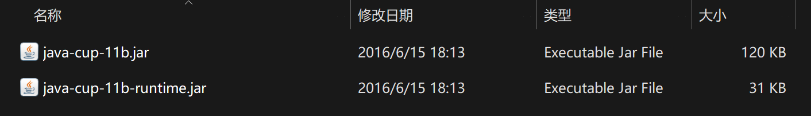


#### 2.2 配置和试用 JavaCUP

> 成功下载并配置后，试运行 JavaCUP 附带的输入源文件例子（一个基于命令行的简单计算器应用），以保证你正确安装并配置了 JavaCUP。
>
> 如果你觉得 JavaCUP 附带的用户手册仍不足以帮助你掌握 JavaCUP 的原理与用法，自己动手在网上查找其他关于 GNU Bison、yacc 等类似工具的大量电子资源。

参考 `calc.cup` 与 `scanner.java`，利用 JavaCUP 工具生成 `Parser.java` 与 `Sym.java`，并修改了一些错误。

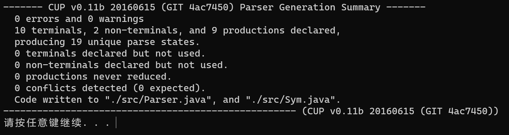

编译后生成如下文件：

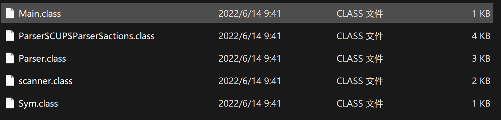

执行成功：

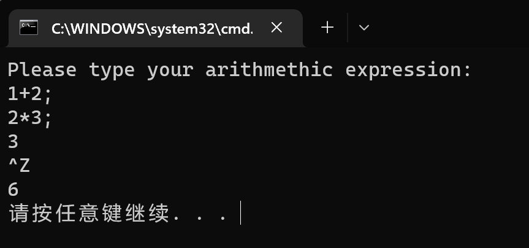

其实采用文件读入能够看到更好的效果，但是在终端中输入表达式也是能够成功运行，测试完成！


#### 2.3 生成 Oberon-0 语法分析和语法制导翻译程序

> 仔细阅读 JavaCUP 使用手册，根据 Oberon-0 语言的 BNF 定义编写一个 JavaCUP 输入源文件。
>
> 根据你的 JavaCUP 输入源文件生成的语法分析程序须完成以下功能：
>
> 1、对于一个存在词法、语法或语义错误的 Oberon-0 源程序，必须至少指出一处错误，并判断错误的类别及产生错误的位置（错误产生的位置定位允许有偏差），并以相应的异常对象向客户程序报告找出的错误的类别。是否支持其他功能取决于你的时间、精力与能力，譬如你可尝试从错误中恢复并继续执行语法分析，也可生成设计图时立即中止程序的执行。在错误检查与错误恢复（指找到错误后继续执行分析过程的能力）方面做得优秀的实验可获得更高的评分。 
>
> 2、对于一个词法、语法和语义完全正确的 Oberon-0 源程序，自动计算出该源程序的复杂度。本文档第 4 部分详细介绍了 ALIOTH 工具所基于的语法制导复杂性度量模型。
>
> 你在生成 Oberon-0 语言的语法分析程序时，可以直接使用实验二由 JFlex 生成的 Oberon-0 语言的词法分析程序。
>
> 以你编写的源文件为输入运行 JavaCUP，得到 Oberon-0 语言语法分析程序的若干 Java 源代码；编译这些 Java 源程序生成相应的字节码，再分别利用自己在实验一编写的 Oberon-0 源程序及其变异程序测试生成的结果，看看你生成的语法分析和语法制导翻译程序能否正确地识别出 Oberon-0 源程序中的各类错误，并且能否针对正确的 Oberon-0 源程序输出其源程序复杂度，并通过实验软设置给出的自动化测试工具验证正确性。

##### step 1 修改 JFlex

1. 由于 `EOF` 可能作为 oberon-0 中的变量名称存在，因此使用一个特殊的标识符代表 EOF，使用 "_"。

   ```
   %eofval{
   	return "_";
   %eofval}
   ```

2. JFlex 生成的词法分析器中，用于表示位置的成员变量 `yyline` 和 `yycolumn` 是私有成员变量。为了定位错误的位置，需要设置一个 public 的接口用于获取位置信息。

   ```
   %{
   	int getLine() {
   		return yyline + 1;
   	}
   	int getColumn() {
   		return yycolumn + 1;
   	}
   %}
   ```

   注意：`yyline` 和 `yycolumn` 是从0开始计数的，而程序代码是从1开始计数的。

##### step 2 设计 Scanner

由于 cup 生成的 parser 中，输入的 token 的类型应为 Symbol 类型，因此需要设计一个 Scanner 将 JFlex 返回的结果转换成 Symbol 类型。其中，在 JFlex 的设计中，`yylex` 用于存储 token 的类型。对于三类 token 需要做特殊处理：

1. 整形 `Integer`，其 terminal 名称为 `NUMBER` ，并保留其原本的值；
2. 注释 `Comment`，过滤，不处理；
3. 标识符 `Identifier`，其 terminal 名称为 `IDENTIFIER` ，并保留其原本的值；

其余的 token 名称均为本身的英文名称。以 `MODULE` 为例：

```
case "MODULE":
	advance();
	return symbolFactory.newSymbol("MODULE", Symbols.MODULE);
```

其中 `advance()` 用于获取下一个 token。

##### step 3 连接 cup 与 Scanner

使用设计的 Scanner 作为 cup 的 scanner，在 parser code 处重载构造函数，并开放获取行号和列号的接口。

```
parser code {:
    protected MyScanner s;
    Parser(MyScanner s) { this.s = s; }
    public int getLine() {
      return s.getLine();
    }
    public int getColumn() {
      return s.getColumn();
    }
    protected int whileCount = 0;
    protected int ifCount = 0;
:}
```

同时，cup 中获取下一个 token 的接口为 Scanner 中编写的 `next_token()`。

```
init with {: s.init(); :};
scan with {: return s.next_token(); :};
```

##### step 4 定义 terminal 与 non terminal

定义 terminal，这里的定义没有分类和排序的意味，仅仅为了避免程序中一行过长。如果硬是说有分类的嫌疑，那只能浅薄地将前两行分作保留字，接下来两行分作标点和符号，最后一行表示关键字和常量。

```
terminal Integer MODULE, BEGIN, END, CONST, TYPE, VAR, PROCEDURE, RECORD, ARRAY, OF;
terminal Integer WHILE, DO, IF, THEN, ELSIF, ELSE, LEFTMIDPAR, RIGHTMIDPAR;
terminal Integer SEMI, DOT, EQUAL, COLON, LEFTPAR, RIGHTPAR, COMMA, COLONEQ, NOTEQUAL;
terminal Integer LESS, LEQ, GREAT, GEQ, ADD, UADD, MINUS, UMINUS, OR, MUL, DIV, MOD, AND, NOT;
terminal Integer IDENTIFIER, NUMBER, INT, BOOL, READ, WRITE, WRITELN;
```

定义 non terminal，non terminal 就是真的没有分类的意味了，毕竟在驼峰命名法下，变量名称都比较长。

```
non terminal Integer modulesBlock, beginStatementSequence, declarations;
non terminal Integer constBlock, identifierExpressions, identifierExpression;
non terminal Integer typeBlock, identifierTypes, identifierType, varBlock;
non terminal Integer identifierListTypes, identifierListType, procedureDeclarations;
non terminal Integer procedureDeclarationBlock, procedureDeclaration, procedureBody;
non terminal Integer procedureHeading, formalParametersBlock, formalParameters;
non terminal Integer fpSectionBlock, semiFpSections, semiFpSection, fpSection;
non terminal Integer varOrNot, types, recordType, semiFieldLists, semiFieldList;
non terminal Integer fieldListBlock, fieldList, arrayType, identifierList;
non terminal Integer commaIdentifiers, commaIdentifier, statementSequence;
non terminal Integer semiStatementBlock, semiStatement, statementBlock, statement;
non terminal Integer whileStatement, ifStatement, elsifBlocks, elsifBlock;
non terminal Integer elseBlock, elseStatement, procedureCall, actualParametersBlock;
non terminal Integer actualParameters, expressionBlock, expressions;
non terminal Integer commaExpressionBlocks, commaExpressionBlock, assignment;
non terminal Integer expression, usimpleExpression, simpleExpression, term;
non terminal Integer factor, selectorBlock, selector, readBlock;
non terminal Integer writeBlock, writelnBlock;
```

优先级定义为：

```
precedence left ADD, UADD, MINUS, UMINUS, OR, MUL, DIV, MOD, AND;
```

##### step 5 编写翻译模式的语法部分

翻译模式的语法部分同 BNF 的定义。需要修改四个部分：

1. 对于 `[statement]`，表示该语句可以出现 0/1 次，改写为：

   ```
   block ::= statement | ;
   ```

2. 对于 `{statement}`，表示该语句可以出现非负整数次，改写为：

   ```
   block ::= block statement | ;
   ```

3. 对于表达式部分，由于符号位只出现在 simple expression中，改写为：

   ```
   expression  ::= usimpleExpression EQUAL usimpleExpression
                 | usimpleExpression NOTEQUAL usimpleExpression
                 | usimpleExpression LESS usimpleExpression
                 | usimpleExpression LEQ usimpleExpression
                 | usimpleExpression GREAT usimpleExpression
                 | usimpleExpression GEQ usimpleExpression
                 | usimpleExpression
                 ;
   
   usimpleExpression   ::= simpleExpression
                         | ADD simpleExpression
                           %prec UADD
                         | MINUS simpleExpression
                           %prec UMINUS
                           ;
   
   simpleExpression   ::= term
                         | simpleExpression ADD simpleExpression
                         | simpleExpression MINUS simpleExpression
                         | simpleExpression OR simpleExpression
                           ;
   
   term    ::= factor
             | term MUL term
             | term DIV term
             | term MOD term
             | term AND term
               ;
   
   factor  ::= IDENTIFIER selectorBlock
             | NUMBER
             | LEFTPAR expression RIGHTPAR
             | NOT factor
               ;
   ```

   该文法为 BNF 的等价文法。对符号位的处理可以使用 `%prec` 声明。

4. 添加 `read`、`write`、`writeln` 的语法定义：

   ```
   readBlock ::= READ actualParametersBlock ;
   writeBlock  ::= WRITE actualParametersBlock ;
   writelnBlock::= WRITELN actualParametersBlock ;
   ```

##### step 6 计算复杂度

计算复杂度的方法同复杂度介绍部分，

1. 对于某些 terminal 具有固定分数的，直接赋值常量：

   ```
   selector    ::= DOT IDENTIFIER {: RESULT = 2; :}
   ```

2. 对于 non terminal 的计算，其结果为文法定义中各个部分的和：

   ```
   selectorBlock   ::= selectorBlock:e1 selector:e2 {: RESULT = e1+e2; :}
   ```

3. 唯一值得介绍的是 `while` 和 `if`，由于两者等价，下面以 `if` 为例展开说明。

   - 首先设置一个全局的 `if` 计数器，当进入 `if` 时计数器加一，离开 `if` 时计数器减一。

     ```
     ifStatement ::= IF {: ifCount += 1; :} expression:e1 THEN 
                         statementSequence:e2
                     elsifBlocks:e3
                     elseBlock:e4
                     END {: RESULT = e1+e2+e3+e4; ifCount -= 1; :}
                     ;
     ```

   - `if` 模块中有两个部分需要进行层数乘法增益，一个是 `expression`，另一个是 `statement`。`statement` 中不仅包含 `expression`，而且包含 `if` 和 `while`。贸然对 `statement` 进行计算会造成额外的乘法。因此将 `statement` 展开，得到`assignment`、`proceduerCall`、`ifStatement`、`whileStatement`。接着将 `assignment` 展开，得到`selector` 和 `expression`。展开后，就得到了需要进行层数乘法增益的模块：`expression`、`selector`、`procedureCall`。对这三个 non terminal 进行乘法计算能够使得重复的计算达到最少，但是仍然存在重复计算的情况出现。`selector`、`factor` 和 `precedureCall` 中都有 `expression` 的出现，这三个模块中的 `expression` 需要除以层数乘法增益，以消除重复的乘法。

##### step 7  语法分析

有很多其他的语法错误，由于 `exception` 中并未进行详细分类，因此错误以输出的形式呈现，并抛出语法错误。

包括但不限于：

1. 期待 `xxx` 但出现 `yyy`；
2. 未识别标识符 / 未识别语句；
3. 缺少运算数 / 运算符 / 左括号 / 右括号。

语法错误可通过 lookahead 判断，在匹配 FIRST 后，即可确定当前的产生式。

1. 如果当前 lookahead 与产生书需求不一致，则会抛出期待 `xxx` 但出现 `yyy` 的错误；
2. 如果当前 lookahead 与所有待匹配的产生式都不一致，则抛出未识别标识符 / 未识别语句错误；
3. 在特定情况下：
   - 当前需要匹配的为运算符但 lookahead 为 factor，则抛出缺少运算符；
   - 如果当前待匹配的为运算数但 lookahead 为 `END` 或者 `;` 等其他符号，则为缺少运算数；
   - 缺少左右括号则为期待 括号 但出现 其他符号 的错误

##### step 8 符号表设计

有很多其他的语义错误，由于 `exception` 中并未进行详细分类，因此错误以输出的形式呈现，并抛出语义错误。

包括但不限于：

1. 类型不匹配；
2. 函数调用参数数量不正确；
3. 常量不能作为左值；

说实话，能够进行语义分析，基本上整个代码就可以编译出来了，而不仅仅是计算复杂度。为了进行语义分析，设计了三个主要的模块：变量模块、类型模块、过程模块。**这三个模块可以解决结构体嵌套、过程嵌套、变量声明周期、变量类型匹配、常量分析等语义问题**。

给出一个例子，下述讨论均从该例子中描述（该例子感谢我的舍友`@lanly`）：

```
MODULE Sample;
    type 
        qq = record
        q:integer;
        b:boolean;
        end;
    var q:boolean;
    p:integer;
    a:record
        a:integer;
        b:qq;
        end;
    c:record
        a:integer;
        b:array 100 of array 100 of qq;
        c:array 100 of array 200 of record
            q: integer;
        end;
    end;
    b:qq;
    PROCEDURE Merge(VAR r,s:ARRAY 100 OF INTEGER;VAR x1,x2,x3:INTEGER);
        type 
            qq = record
                userID:integer;
                b:boolean;
            end;

        var 
            q:integer;
            a:record
                    a:integer;
                    b:qq;
                end;
            c:record
                a:integer;
                b:array 100 of array 100 of qq;
                c:array 100 of array 200 of record
                    q: qq;
                end;
            end;
            b:qq;
        PROCEDURE Mergee(VAR r,s:ARRAY 100 OF INTEGER;VAR x1,x2,x3:INTEGER);
            var q:integer;
            PROCEDURE Mergeee(VAR r,s:ARRAY 100 OF INTEGER;VAR x1,x2,x3:INTEGER);
                var q:integer;
            BEGIN
                x3 := r[124];
            END Mergeee;
        BEGIN
            q:=x1;
        END Mergee;

        BEGIN
            a.b := b;
            c.c[21 + 43][43 + 13].q.b := ~(-1245 * 114514 < (12314 MOD 124 + 214));
            c.c[12-3][b.userID+6].q.userID := 12 + 32 - (-124) * 124 div 45 mod 125 + 32245;
    END Merge;
BEGIN
    a.b.b := q;
    a.b := b;
END Sample.
```

**step 3.1 过程模块**

一个过程可以定义局部变量和局部过程，同时一个过程具有形式参数。之所以需要设计过程模块，是为了规范变量的声明周期。代码中可能存在相同名称的变量，但是其归属需要对调用链进行分析。

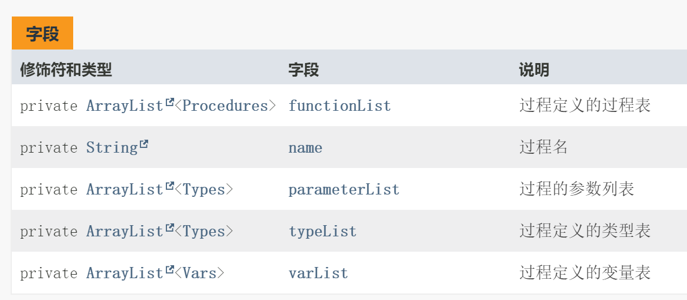

从例子中可以发现，模块 `Sample` 定义了过程 `Merge`，而 `Merge` 定义了子过程 `Mergee`。在 `Sample` 中声明了全局变量 `c` 为一个结构体，而过程 `Mergee` 中声明了局部变量 `c` 为一个数组。这里出现了同名函数，这里就涉及到变量的作用域和生命周期的讨论。

为了解决这个问题，设计了一个过程类，该过程类采用 ArrayList 的形式，记录了在类中声明的变量、类型和子过程。三者都使用引用的方式保存在类中，这样使得整个代码是一个清晰的树状结构。

**step 3.2 变量模块**

`Vars.java` 用于表示一个变量：

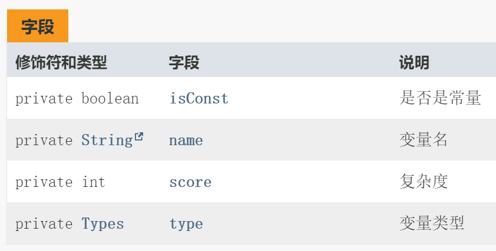

为了解决结构体嵌套的问题，变量中记录的变量的类型，是要用引用的形式呈现的。引用有两个好处：

1. 在解析结构体和数组的时候，能够直接通过类型进入该变量的结构体的成员变量中。由于结构体和数组必定是树状结构，这样能够清晰地反应变量的嵌套关系。
2. 在进行类型比较和匹配的时候，能够直接使用 `=` 匹配。

同时，为了避免对左值进行修改，还记录了变量是否为常量，包括表达式计算的结果，也为左值。

**step 3.3 类型模块**

由于在语义分析时，需要知道变量的类型，因此构建了一个类型模块。之所以需要类型模块细分，是因为在 oberon-0 中，数组和结构体是可以相互嵌套的。也就是说，对于一个 RECORD 类型，其中包含了很多的变量用于表示类型。

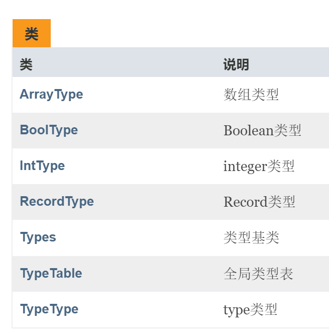

整个类型模块中，最值得一提的就是结构体类型。

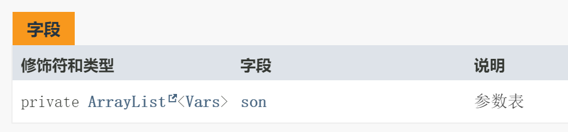

通过一个子类型列表，可以保存其中存在的所有类型。该列表可以看作是一个通过邻接链表的形式保存了一个结构体嵌套的**树状结构**。

##### step 9 符号表的维护

语义分析本质上是对符号表的使用。对于一个模块，记录了四个列表：

- 全局变量表
- 全局类型表
- 全局过程表
- 调用链

调用链即当前所在的语句处于的过程调用链。**每定义一个过程，则会在调用链的尾部添加该过程。离开该过程后，会在调用链中删除该过程，并将该过程添加进全局变量表。**

对于每一个模块，同样记录了三个列表：

- 局部变量表
- 局部类型表
- 局部过程表

**对于新定义的类型和变量，添加进调用链的最后一个过程的变量表和类型表中。如果调用链为空，则添加进全局变量表和全局类型表中。**

**对于查找一个变量，首先从调用链中依次倒序访问各个过程的局部变量表，找到对应的变量。如果调用链中不存在该变量，则在全局变量表中查询。对于过程和类型的查找也是相同的道理。**

##### step 10 语义分析

1. 匹配参数数目：
   - 先倒序查找调用链中定义的过程的参数表。
   - 如果调用链中不存在该过程，则在全局过程表的参数表中查找。
2. 类型匹配：查找相应变量进行类型比较即可。

##### step 11  程序编写

将翻译模式转换为代码即可。

##### step 12 错误恢复

以下错误可进行错误恢复，其余错误均为致命错误。

1. 定义的名称与结束的名称不相同；
2. `END.` 后有多余的代码；
3. 所有的语义错误；
4. 部分变量和语句未找到。

这些错误都不影响代码的分析和执行，打印错误后可继续执行代码。

##### step 13 错误测试

**事实上，这些功能模块的在 cup 中太过繁琐，留到第四问中呈现，该部分只实现了部分功能。**

吐槽：使用 cup 的局限性太大，有一些操作想要实现太过繁琐。

1. 缺少运算符 `test009.bat`

   增加一个翻译模式，`term ::= factor factor`，该翻译模式的优先级要大于 `term ::= factor`，这样能够在不破坏原本文法定义时，获取缺少运算符的翻译模式。

   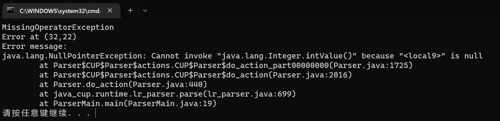

2. 缺少运算数 `test010.bat`

   同样地，增加若干翻译模式，如 `term ::= factor MOD `，该错误语法翻译模式的优先级应高于正确语法的翻译模式。

   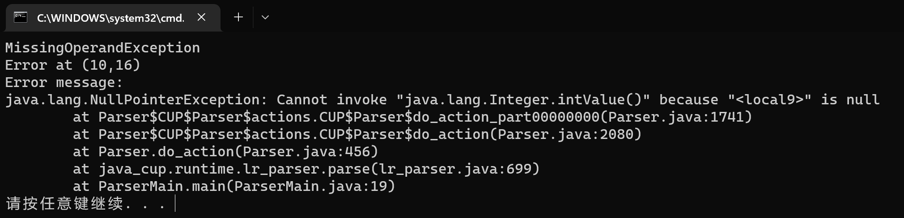

3. 缺少右括号 `test007.bat`

   增加缺少右括号的翻译模式。

   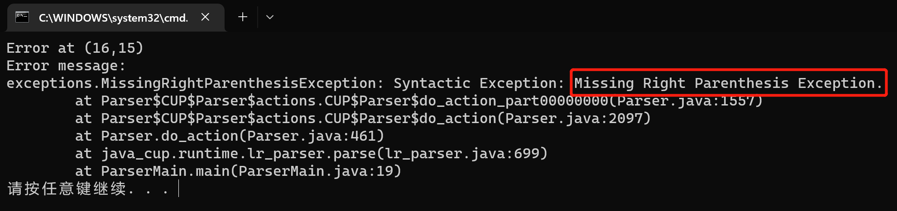

4. 缺少左括号 `test008.bat`

   同理缺少右括号。

   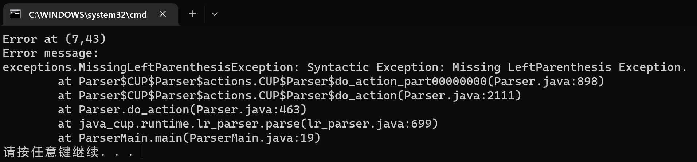


##### step 14：复杂度测试

通过了所有的复杂度测试用例。


此外，`gcd.obr`、`test.08`、`oberon.obr` 均为测试用例，均通过测试。


#### 2.4 生成 Oberon-0 语言的词法分析程序

> 比较两种流行的语法分析程序自动生成工具之间的差异：JavaCUP 和 GNU Bison，主要讨论这两种软件工具接收输入源文件时，在语法规则定义方面存在的差异。关于 GNU Bison 工具的官方资料可在网站 http://www.gnu.org/software/bison/bison.html 找到。
>
> 同样基于 Java 语言的分析器生成工具（Parser Generator，即 Compiler Compiler），还有一个名为 JavaCC 的工具。在网上搜索并浏览关于 JavaCC 的相关信息，用最扼要的一两句话指出 JavaCC 与 JavaCUP 的最核心区别。

这些语法分析程序自动生成工具由于在日常中使用比较少，因此网上的资料也参差不齐，为此，查看完官方文档后，参考了一些前辈总结的工作，得出了如下结论。

##### JavaCUP 和 GNU Bison

两者均是 yacc 族的工具，都能够兼容 yacc，因此注定两者不会有太大的差异。但差异依旧存在，最突出的体现为：

1. **文件结构**

   javaCUP 的文件结构为：

   ```
   package and import declarations // 同JFlex一样,是package和import的声明部分
   action code						// 提供类来封装语法中用户嵌入的代码
   								// 并且提供一系列数据结构和语义动作
   parser code						// parser类,并且重写默认的错误
   init with scan with				// 代码的初始化,以及如何调用scanner
   symbol and grammar				// 声明所有的终结符和非终结符,运行时表示为symbol类
   								// 同时声明语法
   ```

   Bison 的文件结构为：

   ```
   %{ Prologue %}					// 宏定义、函数和变量的声明、include
   Bison declarations				// 终结符和非终结符的声明、优先级
   %%
   grammar rules					// Bison语法规则
   %%
   epilogue						// 生成文件的尾部
   ```

2. **语义动作**

   javaCUP 通过 RESULT 返回语义动作的结果，而 Bison 使用 $ 返回。给出一个两个表达式相加的语义动作

   javaCUP 的写法为：

   ```
   expr ::= expr:e1 PLUS expr:e2 {: RESULT = e1+e2;  :};
   ```

   Bison 的写法为：

   ```
   expr : expr '+' expr { $$ = $1 + $3; };
   ```

3. **优先级**

   javaCUP 的优先级定义方式为：

   ```
   precedence left/right non_terminal name
   // like:
   // precedence left PLUS, MINUS;
   ```

   Bison 的优先级定义为：

   ```
   %left/right non_terminal
   // like:
   // %left '+' '-'
   ```

##### JavaCC 与 JavaCUP

JavaCUP 的语法分析方式为 LALR(k)，而 JavaCC 使用 LL(k)，这是最核心的区别。


### 3 附件

- `\src` 中为代码源文件及复杂度测试用例，`\bin` 中为编译的字节码，`\doc` 中为 `javadoc` 文件，`\javacup` 为使用到的 jar 文件，`\testcase` 中为测试文件，`\simpleCUP` 为简单的 CUP 使用例子。
- `gen.bat` 为 JFlex 和 JAVACUP 的生成脚本，`build.bat` 为 java 的编译脚本，`run.bat` 为运行脚本，`complexty.bat` 为复杂度用例测试脚本，`testxxx.bat` 为带有语法错误的测试脚本，`doc.bat` 为生成 javadoc 的脚本。
- `readme.txt` 为个人信息，`yaccgen.pdf` 为实验报告。

文件目录如下

```
D:.
│  build.bat
│  complexty.bat
│  doc.bat
│  gen.bat
│  readme.txt
│  run.bat
│  test007.bat
│  test008.bat
│  test009.bat
│  test010.bat
│  yaccgen.pdf
│
├─bin
│      LexicalMain.class
│      MyScanner.class
│      OberonScanner.class
│      Parser$CUP$Parser$actions.class
│      Parser.class
│      ParserMain.class
│      Scanner.class
│      Symbols.class
│      TestMain.class
│
├─doc
│
├─javacup
│      complexity.jar
│      exceptions.jar
│      java-cup-11b.jar
│      jflex-full-1.8.2.jar
│
├─src
│      gcd.obr
│      LexicalMain.java
│      MyScanner.java
│      oberon.cup
│      oberon.flex
│      OberonScanner.java
│      Parser.java
│      ParserMain.java
│      Symbols.java
│      testcase.xml
│      TestMain.java
│
└─testcase
        gcd.001
        gcd.002
        gcd.003
        gcd.004
        gcd.005
        gcd.006
        gcd.007
        gcd.008
        gcd.009
        gcd.010
        gcd.011
        gcd.012
        gcd.obr
```

