<center><b><font size = "7">编译原理实验


<center><b><font size = "5">复杂性度量工具 ALIOTH


<center><b><font size = "5">实验报告Part 4

<center><b><font size = "5">手工编写递归下降预测分析程序


### 1 开发环境与开发工具

#### 1.1 操作系统

Windows 11

#### 1.2 编程语言

java语言，JDK版本1.7.2

#### 1.3 开发工具

Visual Studio Code + cmd


### 2 实验内容

#### 2.0 实验目的

> 实验四要求你利用 Java 语言手工编写一个 Oberon-0 语言的语法分析程序，该语法分析程序执行与实验三自动生成的语法分析程序完全相同的功能，即你需要实现 Oberon 源码复杂性度量功能，根据给出的 Oberon 程序源码计算其复杂度。
>
> 该语法分析程序采用递归下降预测分析技术，要求你遵循语法制导翻译思想，先设计 Oberon-0 语言的翻译模式，再据此编写语法分析程序。

#### 2.1 设计 Oberon-0 语言的翻译模式

> 根据 Oberon-0 语言 BNF 定义中的语法规则，以及你完成 Oberon-0 源程序处理的应用需求，为 Oberon-0 语言设计一个合适的翻译模式。
>
> 注意，由于实验四规定使用递归下降的预测分析技术，你需要改造文法以适用于这种自顶向下的分析方法。例如，上下文无关文法中的左递归必须消除，以避免递归下降的预测分析程序进入死循环。

递归下降的预测分析技术使用 LL(1) 算法，该算法的步骤为：

1. 消除二义性。在实验一中已经说明该文法定义不具有二义性。

2. 消除 $\varepsilon$-产生式。举个例子：

   ```
   constBlock  ::= CONST identifierExpressions;
   identifierExpressions ::= identifierExpressions identifierExpression | ;
   ```

   文法定义修改为：

   ```
   constBlock  ::= CONST | CONST identifierExpressions;
   identifierExpressions ::= identifierExpressions identifierExpression;
   ```

3. 消除左递归。举个例子：

   ```
   constBlock  ::= CONST | CONST identifierExpressions;
   identifierExpressions ::= identifierExpressions identifierExpression;
   ```

   修改为：

   ```
   constBlock  ::= CONST | CONST identifierExpressions;
   identifierExpressions ::= identifierExpression identifierExpressions2;
   identifierExpressions2 ::= identifierExpression identifierExpressions2 | ;
   ```

4. 提取左公因子。举个例子：

   ```
   constBlock  ::= CONST | CONST identifierExpressions;
   identifierExpressions ::= identifierExpression identifierExpressions2;
   identifierExpressions2 ::= identifierExpression identifierExpressions2 | ;
   ```

   修改为：

   ```
   constBlock  ::= CONST identifierExpressionsBlock;
   identifierExpressionsBlock ::= identifierExpressions | ;
   identifierExpressions ::= identifierExpression identifierExpressions2;
   identifierExpressions2 ::= identifierExpression identifierExpressions2 | ;
   ```

具体的翻译模式如下，具体动作见代码 `Parser.java`。加上动作足足 1200 行，在此只保留复杂度计算：

```
modulesBlock    ::= MODULE IDENTIFIER SEMI
                        declarations:e1
                    beginStatementSequence:e2
                    END IDENTIFIER DOT {: System.out.println(e1+e2); RESULT = e1+e2; :}
                    ;

beginStatementSequence  ::= BEGIN statementSequence:e {: RESULT = e; :}
                          | {: RESULT = 0; :}
                            ;

declarations    ::= constBlock:e1
                    typeBlock:e2
                    varBlock:e3
                    procedureDeclarations:e4 {: RESULT = e1+e2+e3+e4; :}
                    ;

constBlock  ::= CONST identifierExpressions:e {: RESULT = 5+e; :}
              | {: RESULT = 0; :}
                ;

identifierExpressions   ::= identifierExpression:e2 identifierExpressions:e1
                            {: RESULT = e1+e2; :}
                          | {: RESULT = 0; :}
                            ;

identifierExpression    ::= IDENTIFIER EQUAL expression:e SEMI {: RESULT = 1+e; :}
                            ;

typeBlock   ::= TYPE identifierTypes:e {: RESULT = 10+e; :}
              | {: RESULT = 0; :}
                ;

identifierTypes ::= identifierType:e2 identifierTypes:e1 {: RESULT = e1+e2; :}
                  | {: RESULT = 0; :}
                    ;

identifierType  ::= IDENTIFIER EQUAL types:e SEMI {: RESULT = 1+e; :}
                    ;

varBlock    ::= VAR identifierListTypes:e {: RESULT = e; :}
              | {: RESULT = 0; :}
                ;

identifierListTypes ::= identifierListType:e2 identifierListTypes:e1
                        {: RESULT = e1+e2; :}
                      | {: RESULT = 0; :}
                        ;

identifierListType  ::= identifierList:e1 COLON types:e2 SEMI
                        {: RESULT = e1+e2; :}
                        ;

procedureDeclarations   ::= procedureDeclarationBlock:e2 procedureDeclarations:e1
                            {: RESULT = e1+e2; :}
                          | {: RESULT = 0; :}
                            ;

procedureDeclarationBlock   ::= procedureDeclaration:e SEMI {: RESULT = e; :}
                                ;

procedureDeclaration    ::= procedureHeading:e1 SEMI
                            procedureBody:e2 {: RESULT = e1+e2; :}
                            ;

procedureBody   ::= declarations:e1
                    beginStatementSequence:e2
                    END IDENTIFIER {: RESULT = e1+e2; :}
                    ;

procedureHeading    ::= PROCEDURE IDENTIFIER formalParametersBlock:e
                        {: RESULT = 20+e; :}
                        ;

formalParametersBlock   ::= formalParameters:e {: RESULT = e; :}
                          | {: RESULT = 0; :}
                            ;

formalParameters    ::= fpSectionBlock:e RIGHTPAR {: if (true) throw new MissingLeftParenthesisException(); :}
                      | LEFTPAR fpSectionBlock:e RIGHTPAR {: RESULT = e; :}
                        ;

fpSectionBlock  ::= fpSection:e1 semiFpSections:e2 {: RESULT = e1+e2; :}
                  | {: RESULT = 0; :}
                    ;

semiFpSections  ::= semiFpSection:e2 semiFpSections:e1 {: RESULT = e1+e2; :}
                  | {: RESULT = 0; :}
                    ;

semiFpSection   ::= SEMI fpSection:e {: RESULT = e; :}
                    ;

fpSection   ::= varOrNot:e1 identifierList:e2 COLON types:e3
                {: RESULT = e1+e2+e3; :}
                ;

varOrNot    ::= VAR {: RESULT = 0; :}
              | {: RESULT = 0; :}
                ;

types   ::= IDENTIFIER {: RESULT = 2; :}
          | arrayType:e {: RESULT = e; :}
          | recordType:e {: RESULT = e; :}
          | INT {: RESULT = 1; :}
          | BOOL {: RESULT = 1; :}
            ;

recordType  ::= RECORD
                    fieldListBlock:e1
                    semiFieldLists:e2
                END {: RESULT = 3+e1+e2; :}
                ;

semiFieldLists  ::= semiFieldList:e2 semiFieldLists:e1 {: RESULT = e1+e2; :}
                  | {: RESULT = 0; :}
                    ;

semiFieldList   ::= SEMI fieldListBlock:e {: RESULT = e; :}
                    ;

fieldListBlock  ::= fieldList:e {: RESULT = e; :}
                  | {: RESULT = 0; :}
                    ;

fieldList   ::= identifierList:e1 COLON types:e2 {: RESULT = e1+e2; :}
                ;

arrayType   ::= ARRAY expression:e1 OF types:e2 {: RESULT = 8+e1+e2; :}
                ;

identifierList  ::= IDENTIFIER commaIdentifiers:e {: RESULT = 1+e; :}
                    ;

commaIdentifiers    ::= commaIdentifier:e2 commaIdentifiers:e1
                        {: RESULT = e1+e2; :}
                      | {: RESULT = 0; :}
                        ;

commaIdentifier ::= COMMA IDENTIFIER {: RESULT = 1; :}
                    ;

statementSequence   ::= statementBlock:e1 semiStatementBlock:e2 {: RESULT = e1+e2; :}
                        ;

semiStatementBlock ::= semiStatement:e2 semiStatementBlock:e1 {: RESULT = e1+e2; :}
                      | {: RESULT = 0; :}
                        ;

semiStatement  ::= SEMI statementBlock:e {: RESULT = e; :}
                    ;

statementBlock  ::= statement:e {: RESULT = e; :}
                  | {: RESULT = 0; :}
                    ;

statement   ::= assignment:e {: RESULT = e; :}
              | procedureCall:e {: RESULT = e; :}
              | ifStatement:e {: RESULT = e; :}
              | whileStatement:e {: RESULT = e; :}
              | readBlock:e {: RESULT = e; :}
              | writeBlock:e {: RESULT = e; :}
              | writelnBlock:e {: RESULT = e; :}
                ;

readBlock ::= READ actualParametersBlock:e
              {: RESULT = 8 * (1 + ifCount) * (1 << whileCount) + e; :}
              ;

writeBlock  ::= WRITE actualParametersBlock:e {: RESULT = 8 * (1 + ifCount) * (1 << whileCount) + e; :}
                ;

writelnBlock::= WRITELN actualParametersBlock:e {: RESULT = 8 * (1 + ifCount) * (1 << whileCount) + e; :}
                ;

whileStatement  ::= WHILE {: whileCount += 1; :} expression:e1 DO 
                        statementSequence:e2
                    END {: RESULT = e1+e2; whileCount -= 1; :}
                    ;

ifStatement ::= IF {: ifCount += 1; :} expression:e1 THEN 
                    statementSequence:e2
                elsifBlocks:e3
                elseBlock:e4
                END {: RESULT = e1+e2+e3+e4; ifCount -= 1; :}
                ;

elsifBlocks ::= elsifBlock:e2 elsifBlocks:e1 {: RESULT = e1+e2; :}
              | {: RESULT = 0; :}
                ;

elsifBlock  ::= ELSIF expression:e1 THEN
                    statementSequence:e2 {: RESULT = e1+e2; :}
                ;

elseBlock   ::= elseStatement:e {: RESULT = e; :}
              | {: RESULT = 0; :}
                ;

elseStatement   ::= ELSE
                        statementSequence:e {: RESULT = e; :}
                    ;

procedureCall   ::= IDENTIFIER actualParametersBlock:e {: RESULT = 8 * (1 + ifCount) * (1 << whileCount) + e; :}
                    ;

actualParametersBlock   ::= actualParameters:e {: RESULT = e; :}
                          | {: RESULT = 0; :}
                            ;

actualParameters    ::= LEFTPAR expressionBlock:e {: if (true) throw new MissingRightParenthesisException(); :}
                      | LEFTPAR expressionBlock:e RIGHTPAR {: RESULT = e; :} 
                        ;

expressionBlock ::= expressions:e {: RESULT = e; :}
                  | {: RESULT = 0; :}
                    ;

expressions ::= expression:e1 commaExpressionBlocks:e2 {: RESULT = e1+e2; :}
                ;

commaExpressionBlocks   ::= commaExpressionBlock:e2 commaExpressionBlocks:e1 
                            {: RESULT = e1+e2; :}
                          | {: RESULT = 0; :}
                            ;

commaExpressionBlock    ::= COMMA expression:e {: RESULT = e; :}
                            ;

assignment  ::= IDENTIFIER selectorBlock:e1 COLONEQ expression:e2
                {: RESULT = (e1+2) * (1 + ifCount) * (1 << whileCount) + e2; :}
                ;

expression  ::= usimpleExpression:e1 opUsimpleExpression:e2 
				{: RESULT = (e1 + e2) * (1 + ifCount) * (1 << whileCount); :}

opUsimpleExpression  ::= EQUAL usimpleExpression:e2 
              {: RESULT = e2 + 4; :}
              | NOTEQUAL usimpleExpression:e2 
              {: RESULT = e2 + 4; :}
              | LESS usimpleExpression:e2 
              {: RESULT = e2 + 4; :}
              | LEQ usimpleExpression:e2 
              {: RESULT = e2 + 4; :}
              | GREAT usimpleExpression:e2 
              {: RESULT = e2 + 4; :}
              | GEQ usimpleExpression:e2 
              {: RESULT = e2 + 4; :}
              | {: RESULT = 0; :}
              ;

usimpleExpression   ::= simpleExpression:e {: RESULT = e; :}
                      | ADD simpleExpression:e {: RESULT = e+2; :}
                        %prec UADD
                      | MINUS simpleExpression:e {: RESULT = e+2; :}
                        %prec UMINUS
                        ;

simpleExpression ::= term:e1 opTerm:e2 {: RESULT = e1 + e2; :}

opTerm   ::= ADD simpleExpression:e2 {: RESULT = e2+2; :}
           | MINUS simpleExpression:e2 {: RESULT = e2+2; :}
           | OR simpleExpression:e2 {: RESULT = e2+6; :}
           | {: RESULT = 0; :}
           	 ;

term	::= facotr:e1 operTerm:e2 {: RESULT = e1 + e2; :}

operTerm    ::= MUL term:e2 {: RESULT = e2+4; :}
          	  | DIV term:e2 {: RESULT = e2+4; :}
          	  | MOD term:e2 {: RESULT = e2+4; :}
          	  | AND term:e2 {: RESULT = e2+6; :}
          	  | {: RESULT = 0; :}
            ;

factor  ::= IDENTIFIER selectorBlock:e {: RESULT = e; :}
          | NUMBER {: RESULT = 0; :}
          | LEFTPAR expression:e RIGHTPAR {: RESULT = 6 + e / (1 + ifCount) / (1 << whileCount); :}
          | NOT factor:e {: RESULT = 6+e; :}
            ;

selectorBlock   ::= selector:e2 selectorBlock:e1 {: RESULT = e1+e2; :}
                  | {: RESULT = 0; :}
                    ;

selector    ::= DOT IDENTIFIER {: RESULT = 2; :}
              | LEFTMIDPAR expression:e RIGHTMIDPAR {: RESULT = 2 + e / (1 + ifCount) / (1 << whileCount); :}
                ;
```


#### 2.2 编写递归下降预测分析程序

> 根据上一步骤获得的翻译模式，利用 Java 语言设计并实现一个 Oberon-0 语言的递归下降预测分析程序。
>
> 结合编译原理理论课所学知识，从一个翻译模式设计一个递归下降预测分析程序已有比较成熟的启发式规则，你应遵循这些规则设计你的语法分析程序。
>
> 例如：文法的每一非终结符号应对应着一个递归子程序，开始符号则对应着其中的主程序；由向前看符号（Lookahead）决定分支动作；每一个继承属性对应一个形式参数，所有综合属性对应返回值，子结点的每一属性对应一个局部变量；翻译模式中产生式右部的结终符号、非终结符号与语义动作分别执行匹配、递归调用和嵌入代码等动作。

##### step 1 递归下降预测分析程序框架

假如如下文法：
$$
\begin{aligned}
& S\ \rarr\ (\ L\ )\mid a\\
& L\ \rarr\ SL'\\
& L' \rarr\ ,SL'\mid \epsilon
\end{aligned}
$$
其递归下降预测分析程序为：

```java
void S() throws SyntacticException {
    if (lookahead.equals(new Token('('))) {
        match(new Token('('));
        L();
        match(new Token(')'));
    } else if (lookahead.equals(new Token('a'))) {
        match(new Token('a'));
    } else throw new SyntacticException();
}

void L() throw new SyntacticException() {
    S();
    Ldot();
}

void Ldot() throw new SyntacticException() {
    if (lookahead.equal(new Token(','))) {
        match(new Token(','));
        S();
        Ldot();
    } else if (lookahead in FOLLOW(Ldot)) {
        // do nothing
    } else throw new SyntacticException();
}

void match(Token tok) throws SyntacticException {
    if (lookahead.equals(tok))
    	lookahead = scanner.getNextToken();
    else throw new SyntacticException();
}
```

##### step 2 语法分析

有很多其他的语法错误，由于 `exception` 中并未进行详细分类，因此错误以输出的形式呈现，并抛出语法错误。

包括但不限于：

1. 期待 `xxx` 但出现 `yyy`；
2. 未识别标识符 / 未识别语句；
3. 缺少运算数 / 运算符 / 左括号 / 右括号。

语法错误可通过 lookahead 判断，在匹配 FIRST 后，即可确定当前的产生式。

1. 如果当前 lookahead 与产生书需求不一致，则会抛出期待 `xxx` 但出现 `yyy` 的错误；
2. 如果当前 lookahead 与所有待匹配的产生式都不一致，则抛出未识别标识符 / 未识别语句错误；
3. 在特定情况下：
   - 当前需要匹配的为运算符但 lookahead 为 factor，则抛出缺少运算符；
   - 如果当前待匹配的为运算数但 lookahead 为 `END` 或者 `;` 等其他符号，则为缺少运算数；
   - 缺少左右括号则为期待 括号 但出现 其他符号 的错误

##### step 3 符号表设计

有很多其他的语义错误，由于 `exception` 中并未进行详细分类，因此错误以输出的形式呈现，并抛出语义错误。

包括但不限于：

1. 类型不匹配；
2. 函数调用参数数量不正确；
3. 常量不能作为左值；

说实话，能够进行语义分析，基本上整个代码就可以编译出来了，而不仅仅是计算复杂度。为了进行语义分析，设计了三个主要的模块：变量模块、类型模块、过程模块。**这三个模块可以解决结构体嵌套、过程嵌套、变量声明周期、变量类型匹配、常量分析等语义问题**。

给出一个例子，下述讨论均从该例子中描述（该例子感谢我的舍友`@lanly`）：

```
MODULE Sample;
    type 
        qq = record
        q:integer;
        b:boolean;
        end;
    var q:boolean;
    p:integer;
    a:record
        a:integer;
        b:qq;
        end;
    c:record
        a:integer;
        b:array 100 of array 100 of qq;
        c:array 100 of array 200 of record
            q: integer;
        end;
    end;
    b:qq;
    PROCEDURE Merge(VAR r,s:ARRAY 100 OF INTEGER;VAR x1,x2,x3:INTEGER);
        type 
            qq = record
                userID:integer;
                b:boolean;
            end;

        var 
            q:integer;
            a:record
                    a:integer;
                    b:qq;
                end;
            c:record
                a:integer;
                b:array 100 of array 100 of qq;
                c:array 100 of array 200 of record
                    q: qq;
                end;
            end;
            b:qq;
        PROCEDURE Mergee(VAR r,s:ARRAY 100 OF INTEGER;VAR x1,x2,x3:INTEGER);
            var q:integer;
            PROCEDURE Mergeee(VAR r,s:ARRAY 100 OF INTEGER;VAR x1,x2,x3:INTEGER);
                var q:integer;
            BEGIN
                x3 := r[124];
            END Mergeee;
        BEGIN
            q:=x1;
        END Mergee;

        BEGIN
            a.b := b;
            c.c[21 + 43][43 + 13].q.b := ~(-1245 * 114514 < (12314 MOD 124 + 214));
            c.c[12-3][b.userID+6].q.userID := 12 + 32 - (-124) * 124 div 45 mod 125 + 32245;
    END Merge;
BEGIN
    a.b.b := q;
    a.b := b;
END Sample.
```

**step 3.1 过程模块**

一个过程可以定义局部变量和局部过程，同时一个过程具有形式参数。之所以需要设计过程模块，是为了规范变量的声明周期。代码中可能存在相同名称的变量，但是其归属需要对调用链进行分析。

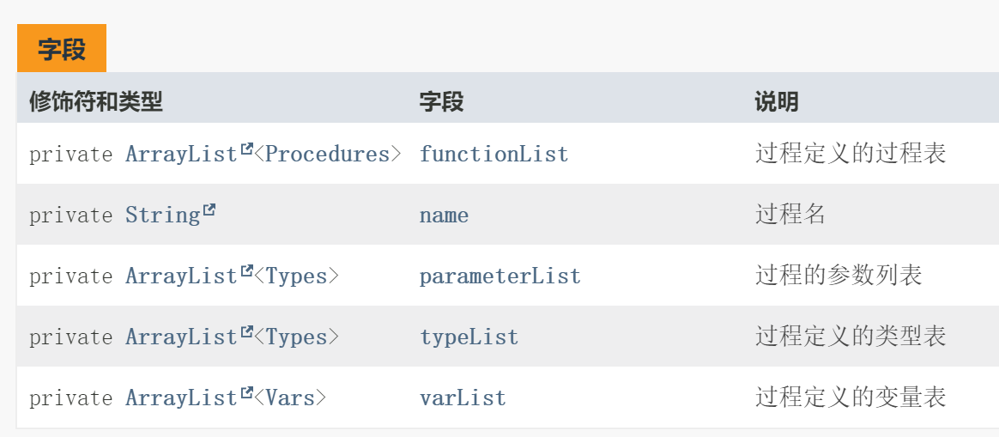

从例子中可以发现，模块 `Sample` 定义了过程 `Merge`，而 `Merge` 定义了子过程 `Mergee`。在 `Sample` 中声明了全局变量 `c` 为一个结构体，而过程 `Mergee` 中声明了局部变量 `c` 为一个数组。这里出现了同名函数，这里就涉及到变量的作用域和生命周期的讨论。

为了解决这个问题，设计了一个过程类，该过程类采用 ArrayList 的形式，记录了在类中声明的变量、类型和子过程。三者都使用引用的方式保存在类中，这样使得整个代码是一个清晰的树状结构。

**step 3.2 变量模块**

`Vars.java` 用于表示一个变量：

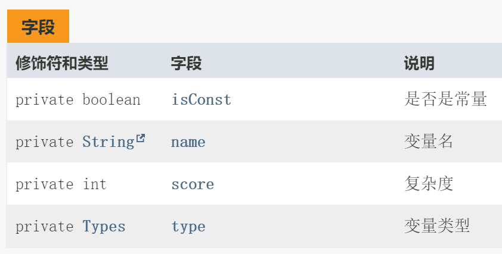

为了解决结构体嵌套的问题，变量中记录的变量的类型，是要用引用的形式呈现的。引用有两个好处：

1. 在解析结构体和数组的时候，能够直接通过类型进入该变量的结构体的成员变量中。由于结构体和数组必定是树状结构，这样能够清晰地反应变量的嵌套关系。
2. 在进行类型比较和匹配的时候，能够直接使用 `=` 匹配。

同时，为了避免对左值进行修改，还记录了变量是否为常量，包括表达式计算的结果，也为左值。

**step 3.3 类型模块**

由于在语义分析时，需要知道变量的类型，因此构建了一个类型模块。之所以需要类型模块细分，是因为在 oberon-0 中，数组和结构体是可以相互嵌套的。也就是说，对于一个 RECORD 类型，其中包含了很多的变量用于表示类型。


整个类型模块中，最值得一提的就是结构体类型。

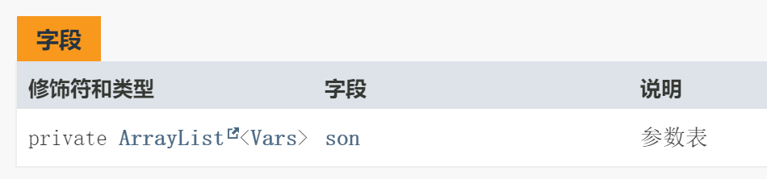

通过一个子类型列表，可以保存其中存在的所有类型。该列表可以看作是一个通过邻接链表的形式保存了一个结构体嵌套的**树状结构**。

##### step 4 符号表的维护

语义分析本质上是对符号表的使用。对于一个模块，记录了四个列表：

- 全局变量表
- 全局类型表
- 全局过程表
- 调用链

调用链即当前所在的语句处于的过程调用链。**每定义一个过程，则会在调用链的尾部添加该过程。离开该过程后，会在调用链中删除该过程，并将该过程添加进全局变量表。**

对于每一个模块，同样记录了三个列表：

- 局部变量表
- 局部类型表
- 局部过程表

**对于新定义的类型和变量，添加进调用链的最后一个过程的变量表和类型表中。如果调用链为空，则添加进全局变量表和全局类型表中。**

**对于查找一个变量，首先从调用链中依次倒序访问各个过程的局部变量表，找到对应的变量。如果调用链中不存在该变量，则在全局变量表中查询。对于过程和类型的查找也是相同的道理。**

##### step 5 语义分析

1. 匹配参数数目：
   - 先倒序查找调用链中定义的过程的参数表。
   - 如果调用链中不存在该过程，则在全局过程表的参数表中查找。
2. 类型匹配：查找相应变量进行类型比较即可。

##### step 6 UML设计

代码设计与逻辑如下：

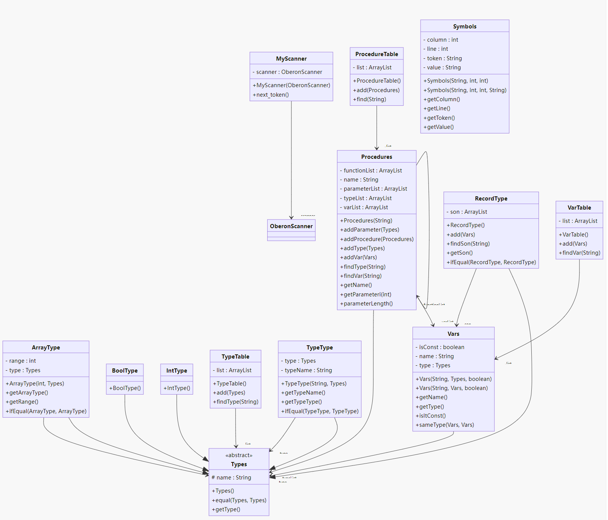

##### step 7 程序编写

将翻译模式转换为代码即可。

##### step 8 错误恢复

以下错误可进行错误恢复，其余错误均为致命错误。

1. 定义的名称与结束的名称不相同；
2. `END.` 后有多余的代码；
3. 所有的语义错误；
4. 部分变量和语句未找到。

这些错误都不影响代码的分析和执行，打印错误后可继续执行代码。

##### step 9 测试

复杂度测试正确率100%，并测试 `gcd.obr` 并正确。

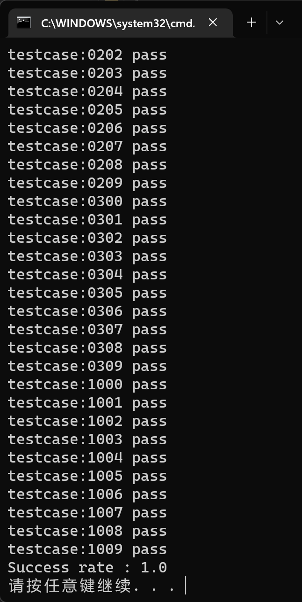

**语法错误之缺少括号 `gcd.007`**

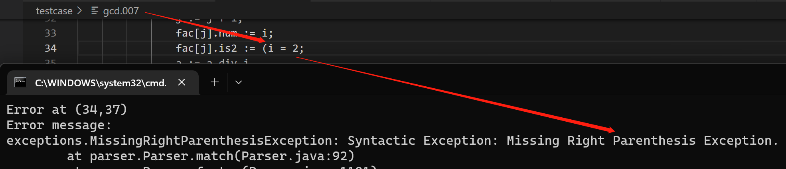

**语法错误之缺少运算数 `gcd.010`**

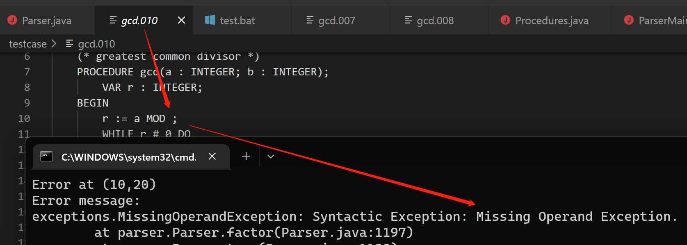

但是由于该算法属于 LL(1) 技术，没有办法预知后续可能出现的 token，加之个人实现存在一些有失偏颇的地方，对于一些语法错误，比如缺少左括号，会匹配到一些其他的 preduction 从而进入其他分支，会出现其他的语法错误比如缺少 `END`。

**语义错误之参数数目不对 `gcd.011`**

该例子同时展示了错误恢复。

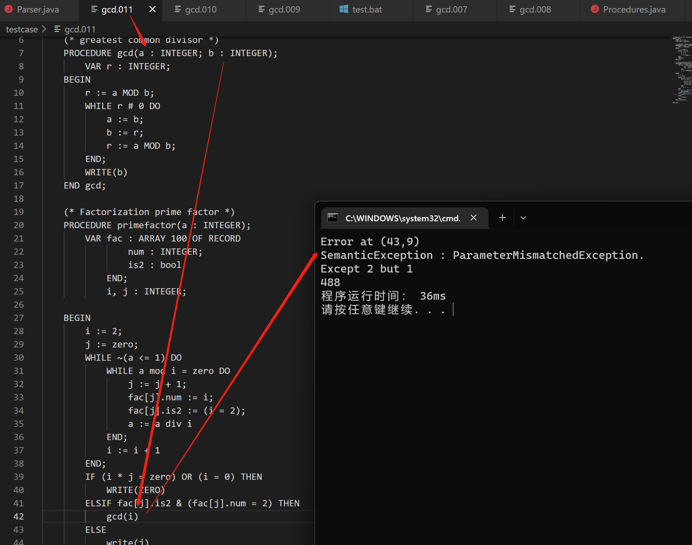

**词法错误之类型不匹配 `gcd.012`**

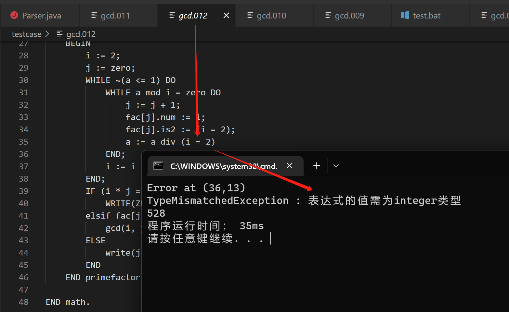

**多重嵌套、同名变量声明周期测试之复杂程序 `test.13`**

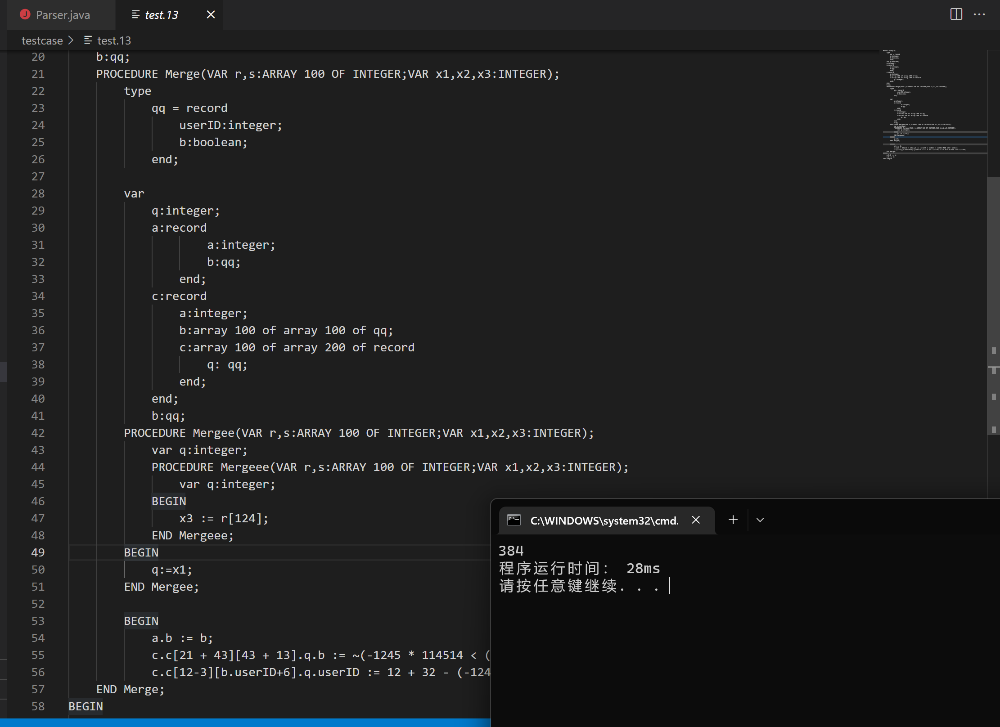


#### 2.3 语法分析讨论：自顶向下 vs. 自底向上

> 通过你自己在实验三和实验四的实际体会，对递归下降预测分析技术和自底向上的 LR 分析技术这两种不同的分析策略进行比较。 
>
> 建议你在比较两种技术的各自优点和不足时，考虑（但不必局限于）以下方面：
>
> - 分析技术的简单性，包括分析程序是否易于调试。
> - 分析技术的通用性，即能处理的语言范围。
> - 是否便于表达语义动作以完成语法制导翻译。
> - 是否易于实现出错恢复。
> - 若以表格驱动方式取代递归程序实现，则分析表大小的优劣如何？
> - 分析速度。

##### 技术的简单性

**如果使用 JAVACUP，毫无疑问 JAVACUP 的实现会更加简单。**使用 JAVACUP 分析文法，只需要定义翻译模式，即可生成语法分析代码。而递归下降预测分析技术需要对文法进行转换使得其符合 LL(1) 的文法要求。

**但如果完全自身编写两种技术的代码，个人认为递归下降预测分析技术在实现上会比自底向上的 LR 分析技术更加简单。**

递归下降预测分析技术采用 LL(1) 文法，属于自顶向下的技术。从开始符号出发，根据产生式规则推导给定的句子，属于推导。

LR 分析技术属于自底向上的技术，从给定的句子规约到文法的开始符号，属于归约。

在代码框架上，递归下降预测分析技术的代码更加简单，对于一个文法进行改造后，仅仅需要将翻译模式中的文法改成函数的递归调用，而动作保持不变，代码就完成了。而自底向上的 LR 分析技术在构造完扩展文法后，需要生成有限状态自动机，状态中需要一个 lookahead 符号，自动机从结构上就比直接递归调用函数更复杂。加之自动机的生成也是一门功夫，因此我个人认为递归下降预测分析技术会更加简单。

在**调试**方面，采用单步跟踪的方式，递归下降预测分析技术实现的代码很容易看到自身处于哪一个状态，只需要查看函数名称和处于文法中的哪一个位置即可。但 LR 分析技术在跟踪时，是出于自动机中的某一个位置，不仅有状态的跳转，还有规约的发生，很容易使得程序员混乱。

##### 技术的通用性

**从通用性的角度看，LR 分析技术会比递归下降预测分析技术包含的文法范围更大。**

从理论上，LL(1) 能够处理的文法为：

（1）文法不存在左递归；

（2）假设 $A\to\alpha\mid\beta$ 是其中一个产生式,  如果 $\alpha$ 或者 $\beta$ 都不能推出 $\varepsilon$，则 $\text{FIRST}(\alpha) \cap \text{FIRST}(\beta) = \varnothing$；

（3）假设 $A\to\alpha\mid\beta$ 是其中一个产生式,  如果 $\alpha$ 或者 $\beta$ 至多有一个能推出 $\varepsilon$，或者其中一个经过若干步能推出 $\varepsilon$，则 $\text{FIRST}(\alpha) \cap \text{FOLLOW}(\beta) = \varnothing$；

文法所有的产生式都要满足以上三种情况才符合LL(1)文法。

而 LR 文法中，对于一个文法 G，我们可以构造一个有限自动机，它能识别 G 的所有活前缀，然后把这个自动机转变成 LR 分析表，按照该 LR 分析表进行 LR 分析，就能保证在分析的过程中，如果分析的句子是正确的，栈里的文法符号（自栈底而上）始终构成活前缀。

从自身编写的体会来看，LR 分析技术可以直接使用语言的 BNF 定义，而递归下降预测分析技术则需要完成文法的转换。

##### 语义动作的简单性

我个人认为两种技术在表达语义动作方面，实现的难度和方式是差不多的。在两个方法中，这部分的代码几乎是一致的。

##### 出错恢复

两者的出错恢复机制都已经是成体系的技术，个人认为两者的难度区别不大。错误恢复技术本身是一致的，具体上，存在恐慌模式、短语层次的错误恢复、出错产生式策略、全局纠正策略等错误恢复技术。

LL 语法分析技术在找不到相应的匹配后，即为发现了一个错误。若用恐慌模式，便抛弃当前的 lookahead，读取下一个，知道找到相应的匹配为止。从实现上来说是简单的。

LR 语法分析技术可以在分析表中加入错误。在查询语法分析动作表并发现一个报错条目时，它就检测到了一个语法错误，在查询 GoTo 表时不会发现语法错误，如果当前已扫描的输入部分不可能存在正确的后续符号串，LR 的输入符号语法分析表就会立刻报错。但绝不会把一个错误的输入符号移入到栈中。从实现上来说，也是简单的。

##### 分析表大小

LL(1) 的分析表的大小为 $\text{non-terminal}\times\text{(terminal+1)}$。

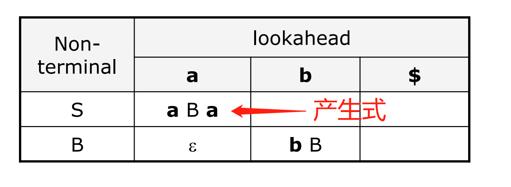

LR(1) 的分析表的大小为 $\text{BNF's state}\times\text{(terminal+non terminal+1)}$。

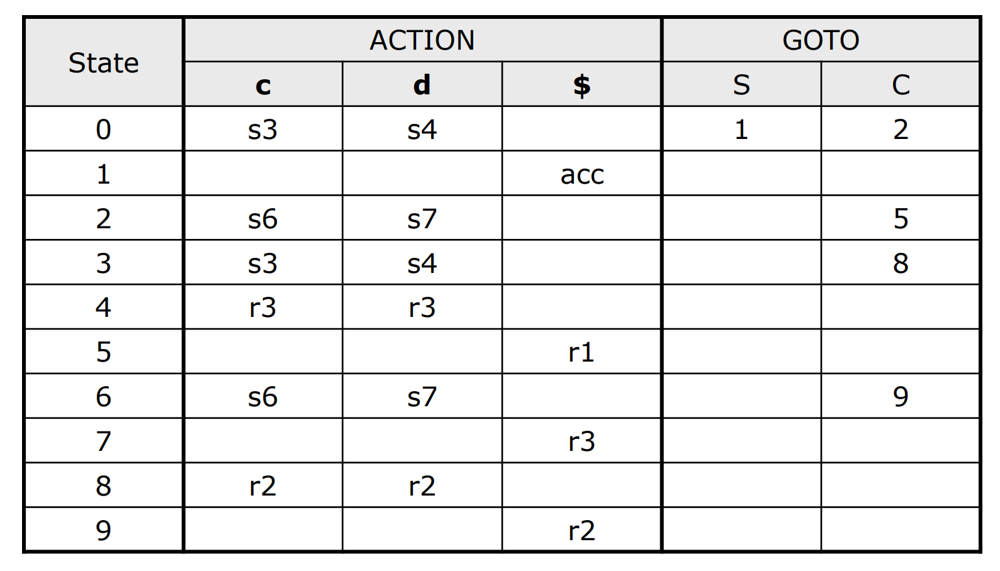

虽然 LALR(1) 会将 LR(1) 的 BNF 中具有相同的产生式集的状态合并，但 BNF 的状态数本身是一个很大的量，所以后者的分析表仍然更大。

##### 分析速度

由于两份代码之间的控制变量方面做的不好，因此没有通过实验进行分析。

从理论上看，两者的分析速度缺少不好比较。一方面，递归下降预测分析程序需要大量的递归操作，涉及到递归栈的问题。众所周知，递归是一个非常慢的实现方式。另一方面，自底向上的操作涉及到在大规模 DNF 上进行转移，同样速度也不快。

对此，`@lanly` 使用一份 13M 的代码进行了对比实验。实验中，`cup` 生成的 LALR 分析算法执行了 11660ms，而递归下降预测分析代码执行了 9876ms，速度是后者更快。很遗憾，鄙人的代码读写性能并不佳，scanner 速度过慢，没有跑出如此完美的数据。当然这不能说明两者的分析速度如何，自能说各有利弊。


### 3 附件

- `gen.bat` 为生成词法分析器脚本，`build.bat` 为编译脚本，`run.bat` 为执行脚本（默认执行`gcd.obr`），`complexty.bat` 为复杂度测试脚本，`testxxx.bat` 为变异程序测试脚本。
- `readme.txt` 为个人信息和使用接口，`scheme.pdf` 为实验报告。
- `\src` 为源文件，`\bin` 为 class 文件，`\doc` 为 javadoc 文件，`\lib` 为依赖文件，`\testcase` 为测试文件。

文件目录如下：

```
C:.
│  build.bat
│  complexty.bat
│  doc.bat
│  gen.bat
│  readme.txt
│  run.bat
│  scheme.pdf
│  test007.bat
│  test010.bat
│  test011.bat
│  test012.bat
│  test013.bat
│
├─bin
│
├─doc
│
├─lib
│      complexity.jar
│      exceptions.jar
│      java-cup-11b.jar
│      jflex-full-1.8.2.jar
│
├─src
│  │  ParserMain.java
│  │  TestMain.java
│  │
│  ├─parser
│  │      Pairs.java
│  │      Parser.java
│  │
│  ├─scanner
│  │      MyScanner.java
│  │      oberon.flex
│  │      OberonScanner.java
│  │      Symbols.java
│  │
│  └─table
│      ├─procedure
│      │      Procedures.java
│      │      ProcedureTable.java
│      │
│      ├─type
│      │      ArrayType.java
│      │      BoolType.java
│      │      IntType.java
│      │      RecordType.java
│      │      Types.java
│      │      TypeTable.java
│      │      TypeType.java
│      │
│      └─var
│              Vars.java
│              VarTable.java
│
└─testcase
        gcd.001
        gcd.002
        gcd.003
        gcd.004
        gcd.005
        gcd.006
        gcd.007
        gcd.008
        gcd.009
        gcd.010
        gcd.011
        gcd.012
        gcd.obr
        test.13
```

